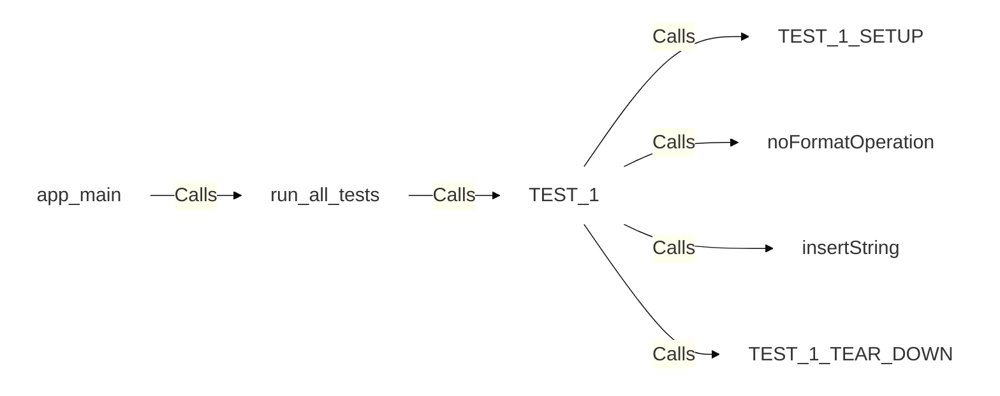

## Flowchart

```mermaid
%%{init: {'theme': 'base', 'themeVariables': { 'primaryColor': '#0000', 'edgeLabelBackground':'#ffffee','fontSize':'20px', 'tertiaryColor': '#fff0f0'}}}%%

graph LR
A[app_main] -- Calls --> B[run_all_tests]
B -- Calls --> C[TEST_1]
C -- Calls --> D[TEST_1_SETUP]
C -- Calls --> E[noFormatOperation]
C -- Calls --> F[insertString]
C -- Calls --> G[TEST_1_TEAR_DOWN]

```
