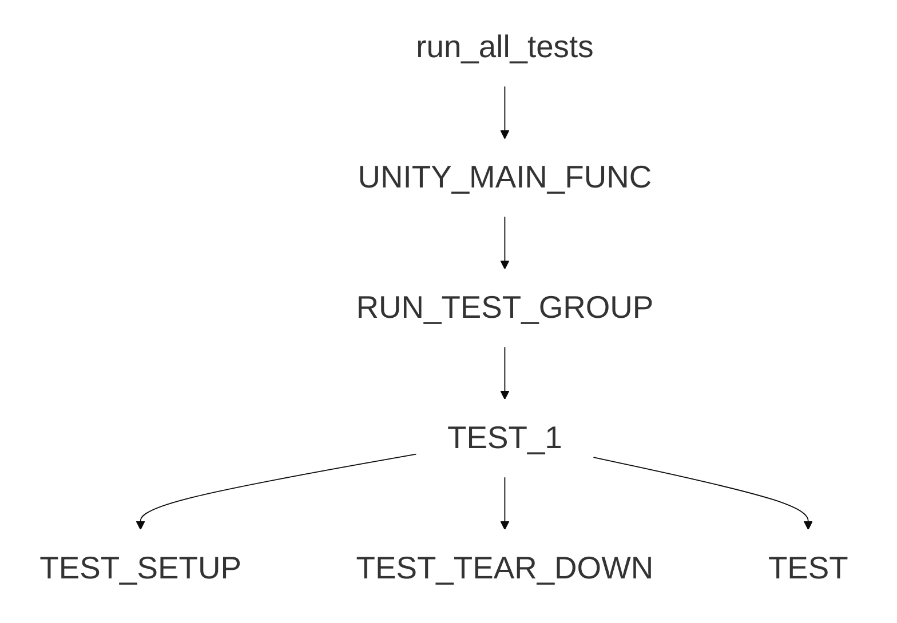

## Flowchart

```mermaid
%%{init: {'theme': 'base', 'themeVariables': { 'primaryColor': '#0000', 'edgeLabelBackground':'#ffffee','fontSize':'30px', 'tertiaryColor': '#fff0f0'}}}%%

graph TD

run_all_tests --> UNITY_MAIN_FUNC
UNITY_MAIN_FUNC --> RUN_TEST_GROUP
RUN_TEST_GROUP --> TEST_1
TEST_1 --> TEST_SETUP
TEST_1 --> TEST_TEAR_DOWN
TEST_1 --> TEST

```
